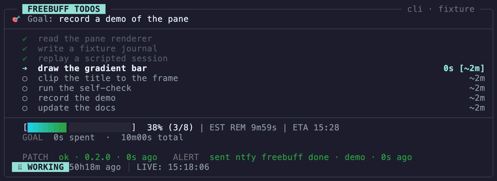
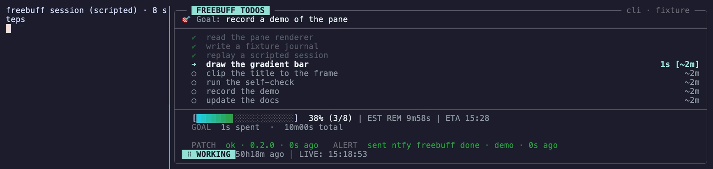

# fbtodo

**Watch your coding agent work — its checklist, live, in a pane beside it.**

[](https://github.com/TLE47/fbtodo/actions/workflows/ci.yml)
[](https://www.python.org)
[](#installation)
[](#installation)
[](LICENSE)

fbtodo displays your [Freebuff](https://freebuff.com) agent's task list in a side pane while it works. It shows:
- **What's done, running, and next** — with live timers
- **How much time is left** — estimates based on your project history
- **If it's stuck or waiting** — with optional alerts to your phone

No configuration: it reads the list your agent already keeps. Freebuff's list turns up on its own;
anything else can push one over stdin — see [docs/SOURCES.md](docs/SOURCES.md).

**[Installation](#installation)** · **[Commands](#commands)** · **[FAQ](#faq)** · [Settings](docs/SETTINGS.md) · [Deep docs](docs/INTERNALS.md)

---

## See it work



The clip above shows - `fbtodo pane` in real time. It monitors a scripted session through eight steps, updating continuously until all tasks are marked complete *and* the session ends—the exact trigger required for the notification bell.

### Side-by-Side View 
To see how the pane mirrors the active session, here is the side-by-side pairing: the scripted session on the left, and the fbtodo pane tracking it on the right:



>**Note**: The recording script exports animations as lossless WebP files rather than standard video formats. This ensures crisp, pixel-perfect inline rendering directly within GitHub Markdown.

---

## Installation

### Quick start

```sh
# 1. Install tmux (shows the pane)
brew install tmux                # or: apt install tmux

# 2. Clone fbtodo
git clone https://github.com/TLE47/fbtodo ~/Projects/fbtodo

# 3. Add to your PATH
mkdir -p ~/.local/bin && ln -sf ~/Projects/fbtodo/fbtodo ~/.local/bin/fbtodo

# 4. Start working
tmux new -s work
fbtodo                           # opens the pane automatically
```

That's it. Requirements: **Python 3.9+** and **tmux**.

### Install with pipx (no clone to manage)

If you would rather not keep a checkout on your PATH, install it as an isolated app:

```sh
pipx install git+https://github.com/TLE47/fbtodo
```

> pipx installs fbtodo into an isolated environment on your PATH. No Python dependencies are required, though displaying the pane still needs tmux
#### Update + virtualenv
```sh
pipx install --force git+https://github.com/TLE47/fbtodo
```
#### Pin version
```sh
pipx install "git+https://github.com/TLE47/fbtodo@4.29.0"
```

### Using the `fb` shortcut (optional)

For a one-word launcher that updates and manages everything:

```sh
. ~/Projects/fbtodo/examples/fb.sh    # add this line to ~/.zshrc or ~/.bashrc
fb                                    # now use 'fb' instead of 'fbtodo'
```

One lazy command:
```sh
echo '. ~/Projects/fbtodo/examples/fb.sh' >> ~/.bashrc && source ~/.bashrc && fb
```

---

## How it works

Your agent writes a todo list (by calling `write_todos`). fbtodo watches that list and displays it in a side pane. The pane updates in real time as the agent works through tasks.

**No configuration needed** — fbtodo reads the list your agent already creates. Just make sure your agent is keeping one. You can ask it once per session: *"Plan this as a todo list and check off items as you go."*

---

## Commands

```sh
fbtodo              # watch the pane (default)
fbtodo bar          # show "todos 3/5" in your status bar
fbtodo snap         # print one snapshot
fbtodo status       # show pane info and why it might be empty
```

**Other commands:** `ledger` (forecast vs. actual), `why` (pane location), `pin` (resize pane), `stop` (close watcher), `prune` (clean up old data).

Run `fbtodo -h` for all flags.

---

## Customization

### Colors

Create `~/.config/fbtodo/theme.json`:

```json
{
  "accent": "#89b4fa",
  "active": "#cdd6f4",
  "success": "#a6e3a1"
}
```

Or use environment variables:

```sh
export FBTODO_ACCENT="#89b4fa"
export FBTODO_SUCCESS="#a6e3a1"
```

Three presets are included in `examples/` (Catppuccin, Gruvbox, Nord).

### Pane size and position

```sh
fbtodo pin --size 24 --side h    # 24 columns wide, beside the session
fbtodo pin --size 12 --side v    # 12 lines tall, below the session
fbtodo pin --list                # show current settings
```

`--size` is counted along the split: **columns** for `--side h` (the pane sits beside the
session) and **lines** for `--side v` (below it). The pane remembers your last size and opens
that way next time. Default: 12 lines below.

### Disable the pane

If you only want the status bar:

```sh
export FBTODO_NO_PANE=1
fbtodo bar        # just show "todos 3/5"
```

---

## Alerts (optional)

Get notifications when your agent finishes, gets stuck, or asks for input:

```sh
# Install the notification kit
mkdir -p ~/.config/freebuff-notify
cp notify/*.py notify/*.sh ~/.config/freebuff-notify/
chmod +x ~/.config/freebuff-notify/*.sh
~/.config/freebuff-notify/phone.sh --init
```

See [notify/README.md](notify/README.md) for details on iMessage and ntfy alerts.

---

## Troubleshooting

| Problem | Fix |
|---|---|
| **Pane is empty** | Run `fbtodo status` — it'll tell you why. Usually the agent hasn't written a list yet. |
| **Pane won't appear** | Make sure you're in tmux and `fbtodo` is in your PATH. |
| **Pane closed** | It'll reopen automatically. If it doesn't, try `fbtodo stop` then run `fbtodo` again. |
| **Wrong size/position** | Use `fbtodo pin --side h` (beside) or `--side v` (below), with `--size N` in columns or lines respectively. |
| **List looks old** | Run `fbtodo status` to check how long ago it was written. |

---

## FAQ

<details open>
<summary><strong>Do I need Freebuff?</strong></summary>

For the built-in stores, yes. But you can use any agent that writes a JSON state file — see [docs/SOURCES.md](docs/SOURCES.md).
</details>

<details>
<summary><strong>Does this send my data anywhere?</strong></summary>

No. fbtodo reads local files only. The only outbound traffic is optional phone notifications (if you install them).
</details>

<details>
<summary><strong>Will it slow my agent down?</strong></summary>

No. It reads files that are being written anyway — the overhead is negligible.
</details>

<details>
<summary><strong>Can I run multiple sessions?</strong></summary>

Yes. Each session gets its own pane, bound to its task list.
</details>

<details>
<summary><strong>Works on Windows?</strong></summary>

WSL only. Windows Terminal + WSL works fine. Native Windows won't work (tmux isn't available).
</details>

<details>
<summary><strong>I just want a status bar, no pane.</strong></summary>

Set `FBTODO_NO_PANE=1` and use `fbtodo bar`. It prints `todos 3/5` and updates every few seconds.
</details>

---

## For developers

Run the test suite:

```sh
python3 fbtodo-selfcheck.py              # full suite (~90-160 seconds)
python3 fbtodo-selfcheck.py --only local-session   # one test
bash notify/test-freebuff-notify.sh      # notification tests
```

---

## License

MIT — see [LICENSE](LICENSE).
