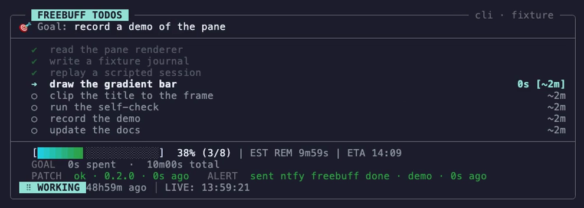
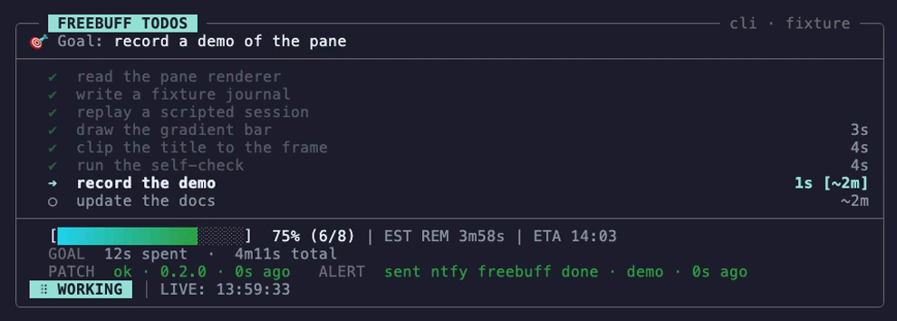
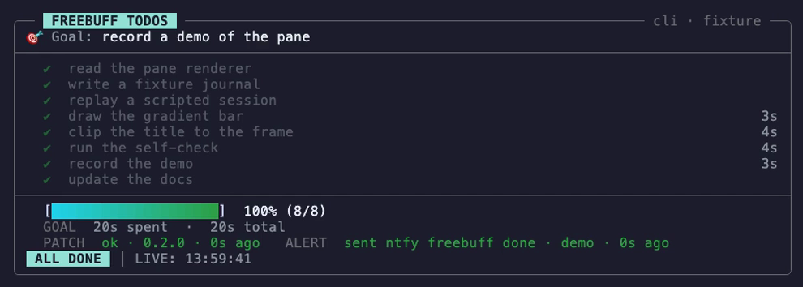
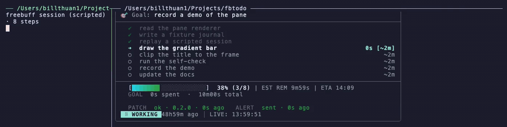

# The demo

Everything here exists so the README can show a real pane instead of a drawing, and so anyone can
record both clips themselves in one command: the pane on its own, and the pane beside the session
it is following.

| File | What it is |
|---|---|
| [`demo.gif`](demo.gif) | the pane-only clip: ~990×354, ~21 s, ~0.5 MB, rendered inline by GitHub |
| [`demo.mp4`](demo.mp4) | the same frames, full colour, for a real player |
| [`demo-start.png`](demo-start.png) · [`demo-mid.png`](demo-mid.png) · [`demo-done.png`](demo-done.png) | three stills from it ([below](#the-stills)) |
| [`side-by-side.gif`](side-by-side.gif) · [`side-by-side.mp4`](side-by-side.mp4) | the pairing: the scripted session and the pane in one window — ~1396×352, ~18 s ([below](#the-pairing)) |
| [`demo.tape`](demo.tape) · [`side-by-side.tape`](side-by-side.tape) | the two [vhs](https://github.com/charmbracelet/vhs) scripts |
| [`record.sh`](record.sh) | `brew install vhs` then `docs/demo/record.sh` → everything above |
| [`drive.sh`](drive.sh) | replays a scripted session into the fixture (~20 s; `DEMO_NARRATE=1` prints each step as it is ticked) |
| [`side-by-side.sh`](side-by-side.sh) | builds the pairing's tmux window and attaches to it (~22 s) |
| [`frame.py`](frame.py) | measures a raw recording and prints the crop that trims it to the box ([The frame](#the-frame)) |
| [`fixture/`](fixture) | the transcript the pane reads: `head.jsonl` (the committed start), `log.jsonl` (what the driver writes), `chat-meta.json`, and the two logs the `PATCH`/`ALERT` rows read |

## Record it

```sh
brew install vhs                # pulls ttyd and ffmpeg; the pairing clip also needs tmux
docs/demo/record.sh             # -> both clips, both GIFs, the three stills
```

Each tape writes a raw MP4; `record.sh` then trims the frame to the pane's own box (see [The
frame](#the-frame)) and everything published is derived from that trimmed master. The GIF's 256
colours therefore cannot cost the video anything, and the video's colour depth cannot make a GIF
band.

The tape points `FBTODO_HOME` at a scratch directory (`/tmp/fbtodo-demo`) on purpose: the
driver's synthetic steps would otherwise be remembered as this project's pace history and
skew the real estimates. It also points `FBTODO_PATCH_LOG` and `FBTODO_ALERT_LOG` at the
fixture logs — without that, those two rows would read **your** notifier log, and your own
name or handle would be published in the GIF.

## The stills

The three PNGs are frames of the master — ~990×354, full colour — so they show the pane exactly as
the animation does, only still.



*One step in: the first row ticked, the second running, the bar at 12% of its eight steps.*



*Six of the eight ticked, with a clock on every row that finished and an estimate on the rest.*



*The last frame: `done/total` full, `ALL DONE` in the status line — the list finishing **and** its
turn ending, which is what the bell waits for.*

## The pairing



The clip the pane exists for: a session on the left, its pane on the right, one tmux window. The
left-hand pane is `drive.sh` with `DEMO_NARRATE=1`, so every step it prints as ticked is a step the
pane shows — the same eight, written to the fixture and read out of it a moment later.

`side-by-side.sh` builds that window and attaches to it. It keeps to a tmux socket of its own
(`tmux -L demo-pair`), so it never touches a server you are working in, and it takes the window
down after ~22 s whether or not anything detached — which is why nothing is left running if a
recording ends mid-attach.

## The frame

Both tapes are trimmed before they are published, and the crop is measured rather than guessed:

```sh
python3 docs/demo/frame.py docs/demo/.demo-raw.mp4 16      # -> W:H:X:Y for ffmpeg's crop
```

The reason a trim is needed at all is the pane's own layout. It draws its box two rows shorter
than the terminal, because the last rows are the shell's; and it serves a list that does not fit by
**collapsing** it (`3 earlier steps completed`) rather than by overflowing the terminal. So a frame
tall enough to show all eight steps always ends in empty rows, and one short enough to have none
hides steps — which is what the first recording of this demo did.

`frame.py` takes the union of the ink's bounding box over three frames of the clip (a second in,
mid-list and the last), adds the tapes' padding, and rounds the size down to even numbers. The
union is what keeps one state of the pane from being cropped by another's measurement, and the same
box trims the width, since the box is centred in the tape's padding. `record.sh` applies the
result to the raw recording and derives everything else from the trimmed master.

## Watch it without vhs

The pane does not care where the transcript came from, so you can run the same thing by hand.
In one shell:

```sh
sh docs/demo/drive.sh
```

…and in a tmux pane below it:

```sh
export FBTODO_HOME=/tmp/fbtodo-demo \
       FBTODO_PATCH_LOG=$PWD/docs/demo/fixture/patch.log \
       FBTODO_ALERT_LOG=$PWD/docs/demo/fixture/phone.log \
       FBTODO_NOTIFY=/none FBTODO_DROP=/none FBTODO_ASK=/none \
       FBTODO_PAUSE=/none FBTODO_PANE_BELL=/none
fbtodo pane --no-daemon --chat docs/demo/fixture -i 0.5 --tick 0.5 --stale-after 0
```

The five `/none` paths are the notify kit's watches, pointed at a file that does not exist so
fbtodo skips them. The fixture *does* reach "done, and the turn ended" — which is a real bell
(and a real push) on a machine with the kit installed. The demo should not ring your phone.

`--chat` takes a directory, `--no-daemon` skips instance detection (there is no Freebuff
process behind this list), and `--stale-after 0` says "never treat it as stale, keep
drawing". A plain `fbtodo -s cli` pointed at a real session needs none of those flags —
they exist for exactly this: driving the renderer by hand. The two log paths are only there
so the `PATCH` and `ALERT` rows show the demo's own fixture instead of yours.

The pairing needs no vhs either — it is one command, on the same fixture:

```sh
sh docs/demo/side-by-side.sh          # ~22 s, then it takes its own window down
```

## What is real here

Everything except the session. `drive.sh` appends the same kind of `write_todos` records an
agent's own calls leave in its journal, `fbtodo pane` is the real renderer reading the real
file, and the clocks, the estimates, the bar and the `done/total` count are the tool's own,
not a mock-up. The pane-only clip's 21 seconds are four ticks of the list plus the final pair — a
list finishing **and** its turn ending, which is what the bell waits for — and the pairing clip is
those same four ticks with the session that writes them on the left.

If you record a demo of your own real session too, say so in the caption — a five-second
clip of an actual agent working is the most convincing thing this repository can have.
